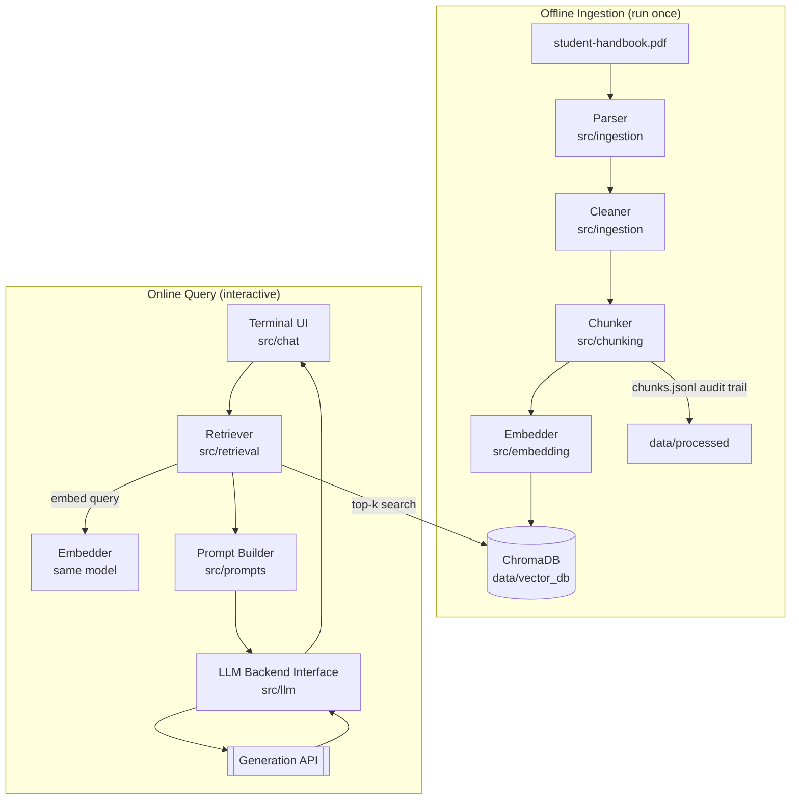
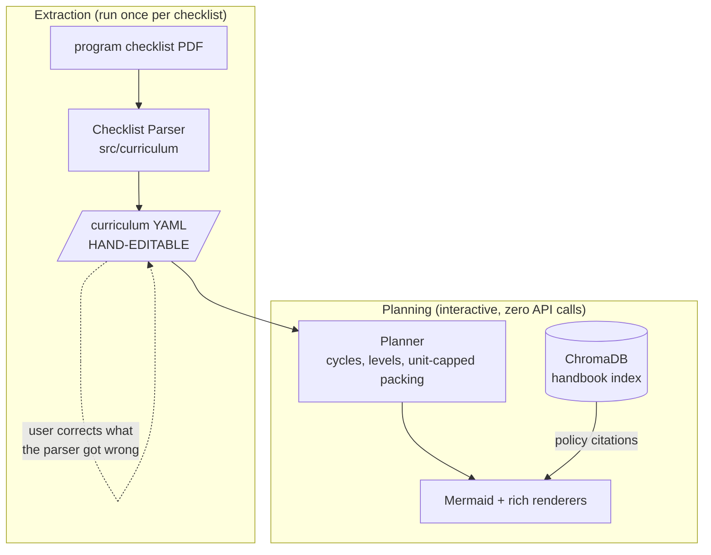

# System Architecture
## DLSU Student Handbook RAG Chatbot

**Prepared by:** AI Systems Architect — v1.0, 20 July 2026

---

## 1. Architectural Overview

The system consists of two independent pipelines sharing a common data store:

1. **Offline ingestion pipeline** — run once per document (or per handbook edition). Parses the PDF, cleans the text, chunks it with structural metadata, embeds the chunks, and persists them in a local vector database.
2. **Online query pipeline** — runs interactively. Embeds the user's question, retrieves the most relevant chunks, assembles a grounded prompt, calls the generation API, and renders the answer with citations in the terminal.

Separating the pipelines means the expensive work (parsing, embedding) happens once, and the chat application starts instantly against a prebuilt index. It also means each pipeline can be tested independently (Requirement: every phase independently testable).



## 2. Key Architectural Decisions

| # | Decision | Rationale |
|---|---|---|
| AD-1 | Two-pipeline design (offline/online) | One-time cost separation; independent testability; instant chat start-up |
| AD-2 | All retrieval components local; only generation via API | Minimizes external dependency and data exposure; keeps the thesis-relevant RAG machinery fully inspectable |
| AD-3 | LLM behind a backend interface (`LLMBackend`) | API provider can be swapped, and a local SLM backend can be added later with zero changes elsewhere (AC-1) |
| AD-4 | Chunk metadata carries `document`, `part`, `section`, `provision` | Verified in Phase 2: main-body sections are globally numbered 1-21, but section *titles* repeat across parts (e.g. "Credit, Grading and Retention" is §10 Undergraduate and §17 Graduate; "Graduation" is §12 and §19) and the Appendices restart provision numbering. Part-level metadata is therefore mandatory to disambiguate duplicated titles and colliding appendix labels, and it enables future multi-document filtering (AC-3) |
| AD-5 | Intermediate artifacts persisted as JSONL (`chunks.jsonl`) | Human-inspectable audit trail between phases; simplifies debugging and the thesis write-up |
| AD-6 | Configuration centralized in `config/settings.yaml` | Model names, top-k, chunk sizes, and API settings changeable without touching code |
| AD-7 | Course ordering (Phase 15) is deterministic code; the LLM is not in the loop | A schedule must be reproducible and auditable, and a confidently wrong schedule is worse than no schedule. A prerequisite graph has an exact answer, so generating one would add risk for nothing. Also practical: the free-tier rate limit is 6000 TPM and the Q&A prompt already spends 3200-4000, so a 60-course checklist could not be sent to the model anyway. Enforced by `tests/test_chat_core.py::test_plan_courses_makes_no_backend_call` |
| AD-8 | The checklist PDF is parsed once into a hand-editable YAML; the planner reads the YAML, never the PDF | The layout of a MyLaSalle checklist export is outside our control and varies by program and college. Rather than pretend the parser is authoritative, extraction writes `data/checklists/<program>.curriculum.yaml` with its warnings and inferred column roles attached, and the user corrects it. The escape hatch is the design, not a fallback — it is what makes an unknown input format survivable, and it makes a plan reproducible from a file the user owns |

## 3. Directory Structure

```
project/
├── config/
│   └── settings.yaml         # models, chunking params, top-k, API config
├── data/
│   ├── handbooks/            # source PDFs (input)
│   ├── processed/            # cleaned text, chunks.jsonl (intermediate)
│   ├── vector_db/            # ChromaDB persistence (output of ingestion)
│   ├── checklists/           # program checklist PDFs + curriculum YAML (gitignored)
│   └── plans/                # generated flowcharts (gitignored)
├── docs/                     # all project documentation
├── scripts/
│   ├── run_ingestion.py      # executes the full offline pipeline
│   ├── run_chat.py           # launches the terminal chatbot
│   ├── inspect_parse.py      # eyeball the handbook parser's output
│   ├── inspect_checklist.py  # eyeball the checklist parser's output (Phase 15)
│   ├── eval_retrieval.py     # retrieval quality against the golden set
│   └── debug_question.py     # trace one question end to end
├── src/
│   ├── ingestion/            # PDF parsing and cleaning
│   ├── chunking/             # section-aware chunker
│   ├── embedding/            # embedding model wrapper
│   ├── retrieval/            # vector store access + retriever
│   ├── prompts/              # prompt templates and assembly
│   ├── llm/                  # LLMBackend interface + API implementation
│   ├── curriculum/           # checklist parsing, course planning, flowcharts
│   ├── chat/                 # terminal interface loop
│   └── utils/                # config loading, logging, token counting
└── tests/                    # mirrors src/ structure
```

No folder exists without a module that needs it; `models/` from the original sketch is omitted because no model weights are stored locally in v1 (the embedding model is cached by its library; the generator is remote).

`data/checklists/` and `data/plans/` are gitignored (with `.gitkeep` placeholders): a curriculum artifact contains the student's own grades.

## 4. Dependencies (proposed)

| Dependency | Purpose | Why this one |
|---|---|---|
| `pdfplumber` | PDF parsing with layout/font info | Font-size access enables reliable heading detection, which plain `pypdf` text extraction cannot do (see chunking_strategy.md §2) |
| `sentence-transformers` | Local embeddings | De-facto standard; simple API; CPU-friendly models |
| `chromadb` | Vector storage + metadata filtering | See vector_database.md |
| Provider SDK or `openai`-compatible client | Generation API | See rag_pipeline.md §7 |
| `pyyaml` | Config | Minimal, readable |
| `rich` | Terminal formatting | Clean citation rendering; low effort |
| `pytest` | Testing | Standard |
| *(none added for Phase 15)* | Course planning | Deliberate: the prerequisite graph uses `graphlib.TopologicalSorter` from the standard library, checklist parsing reuses the `pdfplumber` already present for the handbook, and the artifact format reuses `pyyaml`. A planner that needs `networkx` to topologically sort 60 nodes would be adding a dependency for ~40 lines of code |

## 5. Third Pipeline: Course Planning (Phase 15)

The course planner is a third pipeline that shares the vector store but not the
generation path. It answers a different question — *"given what I have passed,
what can I take next, and in what order?"* — which the handbook cannot answer on
its own: the handbook states policy *about* checklists and flowcharts (§10.1
full-time floor, §10.2 maximum load, §10.10.1 lab co-requisites, §10.19 NSTP)
but contains no course codes, no curriculum, and no prerequisites.

So the feature splits along that seam: **the uploaded checklist supplies the
courses; the handbook index supplies the rules and the citations.**



Two properties distinguish it from the query pipeline. It makes **no LLM call at
all** (AD-7), so a plan is reproducible and costs nothing; and its input is
**parsed once into a file the user owns** (AD-8), so a mis-parsed prerequisite is
a one-line fix rather than a dead end. Full design: `docs/course_planner.md`.

## 6. Scalability Path

- **More documents:** ingest each new PDF with its own `document` metadata value; retrieval optionally filters by document. No schema or code changes.
- **GUI/web front end:** `src/chat` is a thin consumer of two core functions — `answer_question(question) -> Answer` and `plan_courses(curriculum, taken) -> CoursePlan`; a Flask/Streamlit layer would call the same two. All terminal-specific I/O lives in `terminal.py` and `plan_view.py`, never in `core.py` (AC-4).
- **Local SLM:** implement `LocalBackend(LLMBackend)` wrapping Ollama; select via config.
- **Reranking:** insert a reranker between retrieval and prompt assembly; the retriever already returns more candidates than the prompt uses if configured.
