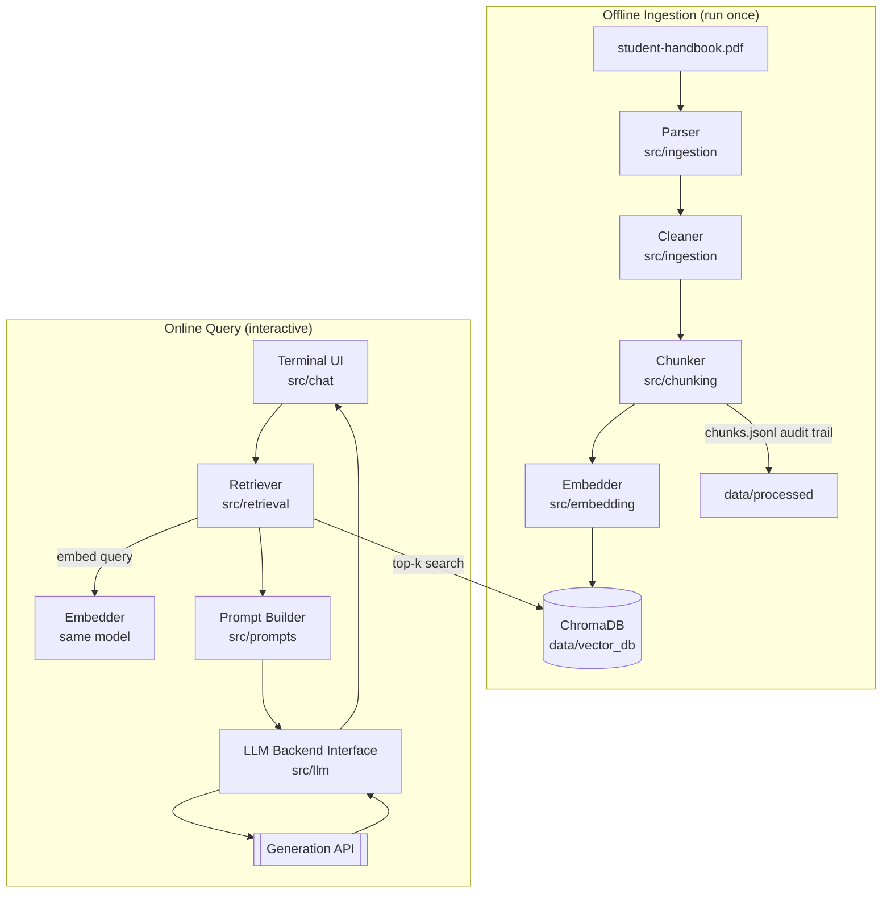

# System Architecture
## DLSU Student Handbook RAG Chatbot

**Prepared by:** AI Systems Architect — v1.0, 20 July 2026

---

## 1. Architectural Overview

The system consists of two independent pipelines sharing a common data store:

1. **Offline ingestion pipeline** — run once per document (or per handbook edition). Parses the PDF, cleans the text, chunks it with structural metadata, embeds the chunks, and persists them in a local vector database.
2. **Online query pipeline** — runs interactively. Embeds the user's question, retrieves the most relevant chunks, assembles a grounded prompt, calls the generation API, and renders the answer with citations in the terminal.

Separating the pipelines means the expensive work (parsing, embedding) happens once, and the chat application starts instantly against a prebuilt index. It also means each pipeline can be tested independently (Requirement: every phase independently testable).



## 2. Key Architectural Decisions

| # | Decision | Rationale |
|---|---|---|
| AD-1 | Two-pipeline design (offline/online) | One-time cost separation; independent testability; instant chat start-up |
| AD-2 | All retrieval components local; only generation via API | Minimizes external dependency and data exposure; keeps the thesis-relevant RAG machinery fully inspectable |
| AD-3 | LLM behind a backend interface (`LLMBackend`) | API provider can be swapped, and a local SLM backend can be added later with zero changes elsewhere (AC-1) |
| AD-4 | Chunk metadata carries `document`, `part`, `section`, `provision` | Verified in Phase 2: main-body sections are globally numbered 1-21, but section *titles* repeat across parts (e.g. "Credit, Grading and Retention" is §10 Undergraduate and §17 Graduate; "Graduation" is §12 and §19) and the Appendices restart provision numbering. Part-level metadata is therefore mandatory to disambiguate duplicated titles and colliding appendix labels, and it enables future multi-document filtering (AC-3) |
| AD-5 | Intermediate artifacts persisted as JSONL (`chunks.jsonl`) | Human-inspectable audit trail between phases; simplifies debugging and the thesis write-up |
| AD-6 | Configuration centralized in `config/settings.yaml` | Model names, top-k, chunk sizes, and API settings changeable without touching code |

## 3. Directory Structure

```
project/
├── config/
│   └── settings.yaml         # models, chunking params, top-k, API config
├── data/
│   ├── handbooks/            # source PDFs (input)
│   ├── processed/            # cleaned text, chunks.jsonl (intermediate)
│   └── vector_db/            # ChromaDB persistence (output of ingestion)
├── docs/                     # all project documentation
├── scripts/
│   ├── run_ingestion.py      # executes the full offline pipeline
│   └── run_chat.py           # launches the terminal chatbot
├── src/
│   ├── ingestion/            # PDF parsing and cleaning
│   ├── chunking/             # section-aware chunker
│   ├── embedding/            # embedding model wrapper
│   ├── retrieval/            # vector store access + retriever
│   ├── prompts/              # prompt templates and assembly
│   ├── llm/                  # LLMBackend interface + API implementation
│   ├── chat/                 # terminal interface loop
│   └── utils/                # config loading, logging, token counting
└── tests/                    # mirrors src/ structure
```

No folder exists without a module that needs it; `models/` from the original sketch is omitted because no model weights are stored locally in v1 (the embedding model is cached by its library; the generator is remote).

## 4. Dependencies (proposed)

| Dependency | Purpose | Why this one |
|---|---|---|
| `pdfplumber` | PDF parsing with layout/font info | Font-size access enables reliable heading detection, which plain `pypdf` text extraction cannot do (see chunking_strategy.md §2) |
| `sentence-transformers` | Local embeddings | De-facto standard; simple API; CPU-friendly models |
| `chromadb` | Vector storage + metadata filtering | See vector_database.md |
| Provider SDK or `openai`-compatible client | Generation API | See rag_pipeline.md §7 |
| `pyyaml` | Config | Minimal, readable |
| `rich` | Terminal formatting | Clean citation rendering; low effort |
| `pytest` | Testing | Standard |

## 5. Scalability Path

- **More documents:** ingest each new PDF with its own `document` metadata value; retrieval optionally filters by document. No schema or code changes.
- **GUI/web front end:** `src/chat` is a thin consumer of a `answer_question(question) -> Answer` core function; a Flask/Streamlit layer would call the same function.
- **Local SLM:** implement `LocalBackend(LLMBackend)` wrapping Ollama; select via config.
- **Reranking:** insert a reranker between retrieval and prompt assembly; the retriever already returns more candidates than the prompt uses if configured.
