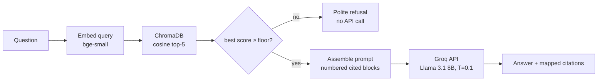

# RAG Pipeline Design
## DLSU Student Handbook RAG Chatbot

**Prepared by:** RAG Specialist — v1.0, 20 July 2026

Each stage below states the decision, the alternatives considered, and the reasoning.

---

## 1. Ingestion & Parsing

**Decision:** `pdfplumber`, retaining per-line font metadata.
**Alternatives:** `pypdf` (plain text only — cannot distinguish headings), `PyMuPDF` (capable, slightly less approachable API), `unstructured` (heavy dependency, opaque behavior — conflicts with the project philosophy of understandability).
**Reasoning:** Structural analysis showed that plain linearized text (`pdftotext`) detects only ~200 of the numbered provisions reliably, because heading numbers frequently appear inline after text reflow. The handbook is an InDesign export where headings differ in font size/weight from body text; pdfplumber exposes exactly this, making heading detection deterministic and explainable — a better thesis story than a black-box parser.

## 2. Cleaning

**Decision:** Rule-based cleaner removing (a) front matter before the Table of Contents' first content section, (b) standalone page-number lines, (c) repeated running headers/footers, (d) ceremonial front-matter (President's message, founder biography) — these are prose about the university, not policy, and pollute retrieval for questions like "what does the president say" vs actual rules.
**Alternative:** keep everything. Rejected: ceremonial text is semantically similar to many queries ("values", "mission") and would displace policy chunks in top-k.
**Note:** Lasallian values/prayers section is *kept* — it is legitimately queryable content.

## 3. Chunking

See chunking_strategy.md (dedicated document). Summary: section-aware chunking on detected headings; merge provisions under ~80 tokens into their parent grouping; split segments over ~500 tokens at paragraph boundaries with 50-token overlap; every chunk carries part/section/provision/page metadata.

## 4. Embedding & Storage

See embedding_strategy.md and vector_database.md. Summary: `BAAI/bge-small-en-v1.5` (384-dim, local, CPU-fast) into persistent ChromaDB with cosine similarity.

## 5. Retrieval

**Decision:** dense top-k retrieval, k = 5, cosine similarity, with a **similarity floor** (initial 0.35, tuned empirically during testing) below which the system takes the refusal path.
**Alternatives considered:**
- *Higher k (8–10):* more recall but more prompt tokens and more distractor text; 5 × ~350 tokens ≈ 1,750 context tokens is a comfortable, focused budget. Revisit if recall tests fail.
- *Hybrid retrieval (BM25 + dense):* genuinely useful for exact terms like "LOA" or "Section 5.3"; deferred to Future Work to protect v1 simplicity, and recorded as a known limitation.
- *Reranking (cross-encoder):* deferred (Future Work); architecture leaves an insertion point.
- *Metadata filtering:* not user-facing in v1 (single document), but the query API supports it — this is the multi-document scalability hook (AC-3).

**Refusal mechanism (two layers):**
1. Retrieval layer — if the best similarity is below the floor, refuse without calling the API (saves cost, guarantees no hallucination). In practice this fires rarely: on a single-domain corpus even off-topic questions score well above the floor (limitations.md).
2. Generation layer — the prompt instructs the model to state non-coverage when retrieved text does not answer the question (see prompting.md). This is where refusals actually happen.

**Vague-question rescue.** A Layer-2 refusal is ambiguous: either the handbook truly does not cover the question, or it does but the question was phrased nothing like it, so retrieval returned excerpts near the rule rather than on it. Rather than guess, the system spends one small LLM call rewriting the question into handbook vocabulary ("what happens if I copy someone's homework" → "academic dishonesty major offense sanction"), retrieves again, merges with the original chunks, and gives the model one more attempt. If it refuses again, the refusal stands. Questions answered on the first pass never pay for this. See system_design.md §3.1.

## 6. Prompt Assembly

Retrieved chunks are formatted as numbered context blocks, each headed by its citation string (`[1] Undergraduate — Section 10: Credit, Grading, and Retention, prov. 10.3.2, p. 96`). The model is instructed to answer only from these blocks and to reference them by number; the application then maps referenced numbers back to structured citations. Full templates in prompting.md.

## 7. Generation — API Provider Selection

Per AC-1 the primary backend is API-based, behind the `LLMBackend` interface so the provider is swappable via config.

| Provider / model class | Pros | Cons |
|---|---|---|
| **Groq — Llama 3.1 8B Instant** | Free tier; extremely low latency; the model is a genuine *small* open model (8B), preserving the project's SLM narrative — "an SLM executed via hosted inference"; OpenAI-compatible API | Free-tier rate limits; provider availability outside user control |
| Google — Gemini Flash class | Generous free tier; strong instruction following | Larger proprietary model — weakens the SLM framing; separate SDK |
| OpenAI — gpt-4o-mini class | Ubiquitous documentation | No free tier; proprietary |
| Anthropic — Claude Haiku class | Strong grounded-answering behavior | No free tier; proprietary |

**Recommendation:** **Groq serving Llama 3.1 8B Instant** as the default, with the client written against the OpenAI-compatible schema so switching provider = editing two config lines. Reasons: (1) zero cost fits a student project; (2) it keeps the thesis honest — the generator *is* a small language model, merely hosted; (3) latency is excellent for live demos. Gemini Flash is the documented fallback if Groq's free-tier limits bind during testing. *Current free-tier limits and model availability must be verified at implementation time; they change frequently.*

**Generation settings:** temperature 0.1 (NFR-3, factual correctness over creativity), max output ~700 tokens, no streaming in v1 (simpler; add later for UX).

## 8. Data Privacy Note

Only the user's question and the retrieved handbook excerpts are transmitted to the API provider. The handbook is a public document, so exposure is minimal; this is nonetheless documented for the thesis (limitations.md) since "what data leaves the machine" is a predictable defense question.

## 9. Pipeline Diagram

