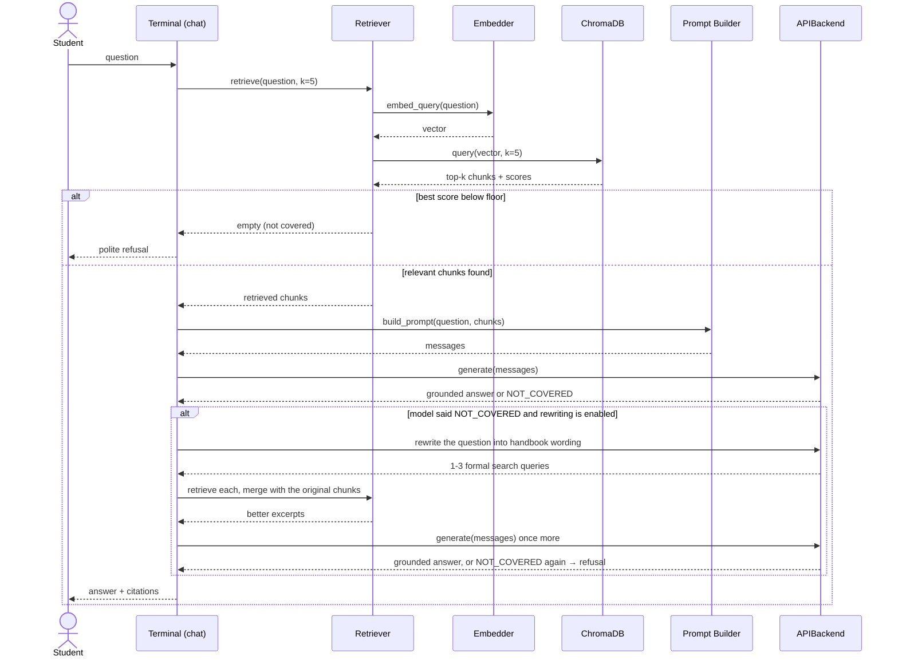

# System Design (Module Level)
## DLSU Student Handbook RAG Chatbot

**Prepared by:** AI Systems Architect — v1.0, 20 July 2026

This document specifies each module's responsibility, interface, and data contracts. See architecture.md for the high-level view.

---

## 1. Data Contracts

### 1.1 Chunk (produced by chunking, consumed by embedding/retrieval)

```json
{
  "chunk_id": "handbook-2125_ug_s10_012",
  "text": "…provision text…",
  "metadata": {
    "document": "student-handbook-2021-2025",
    "part": "Undergraduate",
    "section_number": "10",
    "section_title": "Credit, Grading, and Retention",
    "provision": "10.3.2",
    "pages": [96, 97],
    "token_count": 312
  }
}
```

Rationale: `part` disambiguates duplicated section titles across parts and colliding appendix provision labels (verified in Phase 2); `pages` is best-effort (FR-3 permits section-level citation); `provision` may be null for unnumbered prose.

### 1.2 RetrievedChunk = Chunk + `similarity_score: float`

### 1.3 Answer (returned by the core, rendered by the terminal)

```json
{
  "text": "…generated answer…",
  "citations": [
    {"part": "Undergraduate", "section": "10 — Credit, Grading, and Retention", "provision": "10.3.2", "pages": [96]}
  ],
  "refused": false
}
```

### 1.4 Course / Curriculum (Phase 15 — produced by extraction, consumed by the planner)

The `courses` map is keyed by code and holds the checklist's own order.
`prereqs`/`coreqs` are tuples of codes (ANDed); `confidence` records whether a
course's prerequisites were *stated*, merely *inferred from year/term*, or
*unknown*, so the UI can distinguish "no prerequisites" from "we could not tell".

```yaml
program_id: bscs-st
terms_per_year: 3
prereq_source: column          # column | year_term | none
max_units_override: null       # §10.2 defers to the checklist's own cap
courses:
  CSMATH2:
    title: Discrete Structures
    units: 3
    year: 1
    term: 2
    prereqs: [GEMATMW]
    coreqs: []
    prereq_confidence: stated
    taken: false
    grade: "0.0"               # informational; `taken` is what planning uses
    placeholder: false
```

Rationale: `prereq_source` is a first-class field because extraction cannot know
in advance whether a checklist states prerequisites, and the planner must behave
differently — and *say* differently — in each of the three cases
(`course_planner.md` §4.1). `grade` is kept separate from `taken` so a failed
course is visible without being credited.

### 1.5 Bundle / PlannedTerm / StudyPlan (returned by the planner)

`Bundle` is one or more courses that must share a term (§10.10.1), so the packer
has exactly one kind of thing to place; ordinary courses are one-element bundles.
`StudyPlan` carries `terms` **plus everything it could not schedule** —
`available_now`, `deferred`, `blocked`, `unreachable`, `cycles`, `notes`. Nothing
is silently omitted, and `build_plan` never raises for a data reason: every
problem becomes an entry, mirroring `Answer(error=...)`.

### 1.6 PolicyRule (returned by policy grounding, rendered beside every constraint)

`{key, statement, value, citation, similarity, excerpt}`. `value` is the number
actually applied (from config); `citation` is a real `RetrievedChunk.citation`, or
`None` when retrieval fell below the floor — in which case the number still
applies but the claim of grounding is visibly withdrawn.

### 1.7 CoursePlan (returned by the core, rendered by the terminal)

`{plan: StudyPlan, policy: list[PolicyRule], curriculum: Curriculum, error}` —
the planning counterpart to `Answer`, and the second UI-agnostic seam a future
GUI would call (AC-4).

## 2. Module Specifications

### 2.1 `src/ingestion`
- `parse_pdf(path) -> list[PageContent]` — pdfplumber extraction retaining per-line font size/weight for heading detection.
- `clean(pages) -> list[PageContent]` — removes front matter (cover, acknowledgement form, messages), running headers/footers, standalone page-number lines. Keeps a page map.
- **Testable independently:** given the PDF, produces `data/processed/cleaned.jsonl`.

### 2.2 `src/chunking`
- `chunk(pages) -> list[Chunk]` — implements the strategy in chunking_strategy.md (section-aware; merge small, split large with overlap).
- Output persisted to `data/processed/chunks.jsonl` for inspection.

### 2.3 `src/embedding`
- `Embedder.embed_texts(list[str]) -> ndarray` and `embed_query(str) -> ndarray`.
- Single wrapper class so ingestion and retrieval are guaranteed to use the identical model and normalization (a classic RAG bug when they diverge).

### 2.4 `src/retrieval`
- `VectorStore.add(chunks, vectors)` / `VectorStore.query(vector, k, filters) -> list[RetrievedChunk]` — thin ChromaDB adapter. `load_all()` returns every chunk plus its embedding, for building the keyword index at startup.
- `Retriever.retrieve(question, k) -> list[RetrievedChunk]` — embeds the query, searches, applies the similarity floor used for refusal signaling (see prompting.md §4).
- `BM25Index` — optional keyword index (`retrieval.hybrid.enabled`). When present, `retrieve` fuses the keyword and semantic rankings by reciprocal rank fusion; a keyword-only hit is rescored with its true cosine similarity so every result stays comparable. **Off by default** — measured on this corpus it did not pay for itself (see §6).
- `build_retriever(settings)` — the one place retrieval is wired, shared by the chat app, `scripts/eval_retrieval.py`, and the integration tests.

### 2.5 `src/prompts`
- `build_prompt(question, chunks) -> list[Message]` — system + user messages per prompting.md; formats each chunk with its citation header.

### 2.6 `src/llm`
- `class LLMBackend(ABC): generate(messages) -> str`
- `class APIBackend(LLMBackend)` — v1 implementation; provider, model, temperature from config; retries with backoff; clear error message when the key is missing/invalid.
- Future: `LocalBackend` (Ollama) — no other module changes.

### 2.7 `src/chat`
- `answer_question(question) -> Answer` — the composition core: retrieve → (refuse if below floor) → build prompt → generate → (rewrite rescue if the model refused) → attach citations.
- `plan_courses(curriculum, taken) -> CoursePlan` — the second core entry point (Phase 15): retrieves the policy citations, runs the planner, returns everything the UI needs. **Makes no LLM call** (AD-7).
- `QueryRewriter.rewrite(question) -> list[str]` (`src/chat/rewriter.py`) — one small LLM call turning a casual question into handbook wording. Never raises: a failed rewrite degrades to the behavior without it.
- Terminal loop: banner (name + handbook edition per OI-2), prompt for input, render answer then citations, `exit`/`quit` commands, graceful Ctrl-C. Reserved commands `/plan` and `/help` are dispatched before the question path — explicit dispatch rather than intent classification, because an LLM classifier would cost a call per question and would misroute *"what are the prerequisites for CSOPESY?"*, which is a handbook question.
- `plan_view.py` — every bit of terminal I/O for `/plan` (the multi-step prompting and the `rich` tables), kept out of `core.py` so the core stays UI-agnostic.

### 2.8 `src/curriculum` (Phase 15)
- `checklist_parser.parse_checklist(pdf) -> (Curriculum, ExtractionReport)` — three extraction tiers with column-role voting; see course_planner.md §3.
- `model.write_curriculum_yaml(...) / load_curriculum_yaml(path) -> Curriculum` — the hand-editable artifact (AD-8). Writing refuses to overwrite without `force`; loading validates loudly, except that a prerequisite naming an off-checklist course is a warning with the edge dropped.
- `planner.build_plan(curriculum, taken, *, max_units, min_units, max_terms, pair_labs) -> StudyPlan` — iterative Tarjan cycle detection and deterministic breaking, `graphlib` levelling, corequisite bundling, greedy unit-capped packing under a total tie-break order.
- `policy.load_policy(retriever, planner) -> list[PolicyRule]` — four fixed retrievals against the existing index; zero LLM calls.
- `html_report.render_plan_html(...) / write_plan_html(...)` — the printable plan artifact.

### 2.9 `src/utils`
- Config loader (validated dataclass), logging setup, token counting helper.

## 3. Online Query Sequence



### 3.1 Why the rewrite fires on the model's refusal, not on the score

The obvious trigger — "retrieval scored below the floor, so rewrite" — does not
work here, and it is worth recording why. On a single-domain corpus the
similarity range is compressed: measured against this index, deliberately
off-topic questions ("what is the campus wifi password") score 0.50–0.64,
while the floor sits at 0.35. Nothing realistic falls below it, so a
floor-based trigger would never fire.

Vague questions fail differently. They retrieve the *right section* — 6/6 of
the golden vague set reaches its expected section without any rewriting — but
the excerpts land beside the rule rather than on it, and the model answers
`NOT_COVERED`. That refusal is the honest signal that retrieval missed, so it
is what triggers the rewrite. The cost profile is the same as the intended
one: nothing extra is spent on questions that answer on the first pass.

The floor-based trigger is kept as a cheap pre-check for genuinely hopeless
retrieval, but it is not the mechanism that carries this feature.

## 4. Error Handling Policy

| Failure | Behavior |
|---|---|
| API unreachable / rate limited | Retry ×2 with backoff, then user-facing message; never crash the loop |
| Missing API key | Startup check with instructive message (env var name, where to obtain) |
| Empty/garbled retrieval | Treated as "not covered" → refusal path |
| Ingestion run twice | Idempotent: collection is rebuilt, not duplicated |
| Query rewrite call fails | Returns no queries; the original refusal stands. The rescue is best-effort and never breaks answering |
| Rewrite retrieves nothing new | Second answer call is skipped — re-prompting with identical excerpts would only burn quota |
| Checklist unparseable (Phase 15) | Write the curriculum artifact anyway, with warnings and empty `prereqs:` fields, and tell the user which fields to fill in. A form to complete beats a traceback, and beats a fabricated plan |
| Curriculum artifact already exists | Refuse to overwrite without `--force`. Clobbering hand corrections is the one unforgivable failure for this artifact (AD-8) |
| Curriculum YAML invalid | `CurriculumError` naming the file and the offending course; printed in red, the REPL loop survives |
| Cyclic prerequisites | Report every cycle, break it using the checklist's term order, schedule both courses, and flag it. Refusing to plan would turn a one-cell extraction error into total failure |
| Corequisite bundle exceeds the unit cap | Listed as `unreachable` with a note — never dropped, and never allowed to spin the packing loop |
| Vector index stale/missing during `/plan` | The plan is still produced with its configured numbers; each affected constraint reports that the handbook citation was unavailable, rather than implying grounding it does not have |

## 5. Configuration (settings.yaml sketch)

```yaml
embedding:
  model: BAAI/bge-small-en-v1.5
chunking:
  target_tokens: 350
  max_tokens: 500
  overlap_tokens: 50
  min_tokens: 80        # merge threshold
retrieval:
  top_k: 8
  similarity_floor: 0.35   # guards against false refusals, not off-topic questions
  hybrid:
    enabled: false         # see §6
    rrf_k: 60
    keyword_weight: 0.5
rewrite:
  enabled: true            # vague-question rescue
  margin: 0.05
  max_output_tokens: 150
  max_queries: 3
llm:
  provider: groq            # or gemini/openai/anthropic — same interface
  model: llama-3.1-8b-instant
  temperature: 0.1
  max_tokens: 700
planner:                    # Phase 15; optional section, these are the defaults
  max_units: 15             # Undergraduate §10.2
  min_units: 12             # Undergraduate §10.1 — warns only, never overfills
  max_terms: 8              # packing-loop safety stop and flowchart horizon
  pair_labs: true           # §10.10.1 lab/lecture inference
  checklist_dir: data/checklists
  plan_dir: data/plans
  include_taken: true
```

The `planner` numbers are constants of this handbook edition rather than invented
policy, and `src/curriculum/policy.py` prints the governing provision beside each
one. A per-program override lives in the curriculum artifact
(`program.max_units`), not here, because §10.2 defers to "the number of units
indicated on the program checklist" — see course_planner.md §6.

## 6. Measured: why hybrid retrieval ships disabled

BM25 keyword search was added to recover chunks that match on exact terms but
not on sentence meaning — the motivating case being provision 5.3.1.1.6, a
bare fragment split from its "major offenses" heading that
"Is plagiarism a major offense?" was reported to miss.

Re-measuring first showed the premise had expired: semantic search alone
already retrieves 5.3.1.1.6 in the top 8. Sweeping the fusion weight over the
golden set and the vague set then showed hybrid costs more than it returns —
with only `top_k` slots to fill, keyword hits evict good semantic ones:

| keyword_weight | golden hit@8 | golden hit@1 | vague hit@8 |
|---|---|---|---|
| 0.0 (semantic only) | 10/10 | 8/10 | 8/10 |
| 0.25 – 0.75 | 10/10 | 9/10 | 8/10 |
| 1.0 (standard RRF) | 10/10 | 9/10 | **7/10** |

The code is kept and configurable — it is one line to enable, and the
measurement is reproducible via `scripts/eval_retrieval.py` — but the default
is off, and `keyword_weight` should stay at or below 0.5 if it is turned on.
